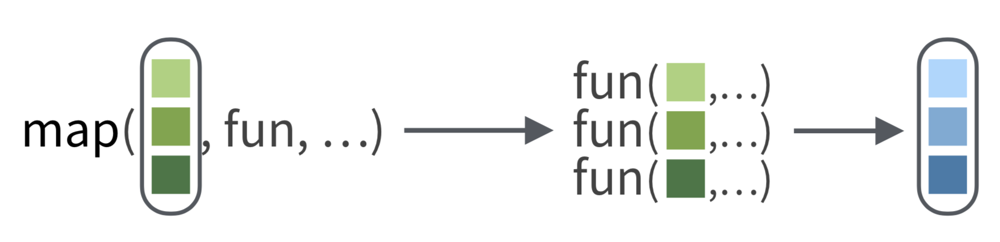

# Introduction

In this tutorial I will give a short introduction on the functionalities of the purrr package. I love this quote by [Rebecca Barter](http://www.rebeccabarter.com/blog/2019-08-19_purrr/) that exactly described my feeling about this package before I started working with it:

> Purrr is one of those tidyverse packages that you keep hearing about, and you know you should probably learn it, but you just never seem to get around to it.

I hope that this short introduction will help you figure out why it is interesting to learn some purrr and give you the first tools to further explore the power of this package!

So what is it about? The [package's homepage](https://purrr.tidyverse.org/) mentions it is all about *functional programming*. Since that term does not make a lot of sense to most biologists I prefer to go for the more alternative description: **It's all about iteration!** I myself, have got to known its usefulness when I was following a machine learning course. I had to apply the same model to different datasets (e.g. training, validation and test dataset) or apply different models (e.g. linear regression or support vector machine) to the exact same dataset. Without purrr, I would have written different *for-loops* to get this done. So remember this: **If you need a *for-loop* to get it done, you can probably use purrr's `map` instead!**

Make sure to check out the [purrr cheatsheet](https://raw.githubusercontent.com/rstudio/cheatsheets/master/pngs/thumbnails/purrr-cheatsheet-thumbs.png) as it gives a handy overview of some of the functions and concepts I will be discussing here.

# Prerequisites

I assume that you are familiar with basic tidyverse verbs and the pipe (`%>%`) operator. 

# Getting started

Purrr is part of the tidyverse. If you do not have that installed, please re-evaluate your life choices and run the following code line:

```{r eval=FALSE}
install.packages("tidyverse")
```

and then load it:

```{r}
library(tidyverse)
```

Next we will load the data that we will be using in this tutorial. Since most of us have a biological background, I will be using a biological dataset: the NCBI Eukaryotic genome dataset.

You can either download the dataset yourself and reformat it a little bit with this code:

```{r}
eukaryotes <- read_tsv(
  file = "ftp://ftp.ncbi.nlm.nih.gov/genomes/GENOME_REPORTS/eukaryotes.txt", 
  na = c("", "na", "-")
)

# Reformat dataset headers
names_new <- names(eukaryotes) %>% 
  str_replace_all("[#%()]", "") %>% 
  str_replace_all("[ /]", "_") %>%
  str_to_lower

eukaryotes <- eukaryotes %>% 
  set_names(names_new)

# Save tibble
write_tsv(eukaryotes, "data/eukaryotes.tsv")
```

or read in the pre-formatted data using the following command:

```{r}
eukaryotes <- read_tsv("data/eukaryotes.tsv")
```

# Exploring our dataset

Let's first have a look at what our dataset looks like.

```{r}
glimpse(eukaryotes)
```

This file contains some basic information about the genomic content of all eukaryotes that were uploaded to the NCBI Genome database. It contains accession numbers, information about the quality of the genome and stats such a average genome size and GC-content. It's a fun dataset to explore if you are interested in molecular biology.

The first question that came to mind when I loaded this dataset was: How many different organisms are there in our dataset? That's easy to answer:

```{r}
eukaryotes %>% 
  pull(organism_name) %>% 
  n_distinct()
```

Okay that seems to be around half the number of observations we have in the dataframe. Naturally, I also have a bunch of other questions I'd like to see answered:

- How many different institutes (centers) submitted a genome?
- The data seem to be grouped in groups. How many groups are there?
- How many sub groups are there?

There's a few ways you can handle this, e.g. the tidyverse verb `summarise()` is helpful for this. Another way to solve this is to use a for-loop.

```{r}
# Keep only variables you are interested in for this analysis
eukaryotes_subset <- eukaryotes %>% 
  select(organism_name, center, group, subgroup)

# Loop over these variables and print out their length
for (variable in 1:length(names(eukaryotes_subset))){
  
  # Get the name of the variable
  name <- names(eukaryotes_subset)[variable]
  
  # Get the number of unique entries of that variable
  length <- eukaryotes_subset[, variable] %>% 
    n_distinct()
  
  print(str_c(name, ": ", length))
  
}
```

The above approach might be a little bit far-fetched, but it works and is an example of the fact that we are applying the same function ( `n_distinct()`) multiple times. And like I said in the beginning, as soon as you run into a for-loop in R, you should immediately start to think about purrr. So how do we solve this with purrr?

# Map function

Time to introduce the workhorse of the purrr package:  `map()`. 

> The map functions transform their input by applying a function to each element of a list or atomic vector and returning an object of the same length as the input. 

In its essence `map()` is the tidyverse equivalent of the base R `apply` family of functions.

The basic syntax is `map(.x, .f, ...)` where:  
- `.x` is a list, vector or dataframe  
- `.f` is a function      

`map()` will then apply `.f` to each element of `.x` in turn. 



That sounds useful, because we **want to apply the function `n_distinct` to each variable of our`eukaryotes_subset`** dataset.

```{r}
map(eukaryotes_subset, n_distinct)
```

or with the pipe operator:

```{r}
eukaryotes_subset %>% 
  map(n_distinct)
```

Nice! 

# Map_ functions

The above is already a very satisfactory result. However, we can do better. 

One property of the  `map()` function is that **it will always return a list**. That can be useful in many cases, but sometimes also very annoying if you want to e.g. quickly plot something. That is where the  `map_*()` functions come in handy. They will return an object of the type you specified ([or die trying](https://purrr.tidyverse.org/reference/map.html)):

- `map_lgl()` returns a logical  
- `map_int()` returns an integer vector
- `map_dbl()` returns a double vector
- `map_chr()` returns a character vector
- `map_df()` returns a data frame

A short demonstration:

```{r}
# Apply n_distinct to all variables, returning a double
map_dbl_result <- eukaryotes_subset %>% 
  map_dbl(n_distinct)

# Print out result
map_dbl_result

# Print out type of result
typeof(map_dbl_result)
```

In this case, it returned a named numeric vector.

Let's try returning a dataframe:

```{r}
# Apply n_distinct to all variables, returning a dataframe
map_df_result <- eukaryotes_subset %>% 
  map_df(n_distinct)

# Print out result
map_df_result

# Check if output is a data frame (tibble in this case)
is_tibble(map_df_result)
```

I think  `map_df` is extremely useful because you can feed it's output directly into a ggplot2 call:

```{r}
eukaryotes_subset %>% 
  map_df(n_distinct) %>% 
  # Convert to longer format
  pivot_longer(everything(), names_to = "variable", values_to = "count") %>%
  # Start plotting
  ggplot(aes(x = variable, y = count)) +
  geom_col() +
  coord_flip()
```

Okay now that we know the basics of the `map()` function, we can move on to examples wherein this functionallity really comes in handy.

# Nested tibbles

But before we do that, a quick detour to nested tibbles!

What is nesting?

> Nesting converts grouped data to a form where each group becomes a single row containing a nested data frame, and unnesting does the opposite.


This kind of format can be useful in many situations, for example:

- You have performed an experiment under 4 different conditions and want to transform the data in exactly the same way, but per condition  
- You have been working with 10 different micro-organisms and do some magic R work on each of these organisms  
- ...   

In our case, we might want to split our dataset according to the groups defined in the `group` variable:

```{r}
eukaryotes %>% pull(group) %>% unique()
```

There's a very simple procedure to do this:

- Group by your variable of interest using `group_by()`
- Use the `nest()` function

```{r}
eukaryotes_nested <- eukaryotes %>% 
  group_by(group) %>% 
  nest()

eukaryotes_nested
```

Interesting! What happened here? If you use Rstudio, opening the newly created `eukaryotes_nested` dataset, might give you a clue.

What happened here, is that our combination of `group_by()` and `nest()` created a tibble, with a regular column and a list column. The latter is a column with a list of 5 different dataframes, one for each grouping variable that was present in our `group` variable.

A closer look to this list column shows us what is going on

```{r}
eukaryotes_nested %>% pull(data)
```

Basically, we have split up our gigantic `eukaryote` data frame into 5 smaller data frames, one for each grouping variable, but still stored in one convenient data frame called  `eukaryotes_nested`. (data frame-ception?)

You can now access each of these sub data frames e.g. using base R list operators:

```{r}
eukaryotes_nested$data[[1]] %>% View()
```

If you had enough of your nested table, you can easily unnest it again using `unnest()`:

```{r}
eukaryotes_nested %>% 
  unnest(data)
```

And everything is back to normal!

# Combining nested tibbles and map

## Getting started

Finally, we are ready to show what the combination of nested tibbles and `map()` are capable of! 

Let's start with something very simple. We have subsetted our data in 5 different data frames. Maybe we first want to know how many observations each of this sub data frame has? We can easily do that using `nrow()` and repeat that 5 times in e.g. a for-loop. However, you have been paying good attention to this tutorial and realise that instead of writing a for-loop, you could just use the `map()` function!

```{r}
map(eukaryotes_nested$data, nrow)
```

Cool, that gives us the result, but not really in a very convenient way. What if we store this output as a new column of our data frame? Creating a new column in the tidyverse means using `mutate()`:

```{r}
eukaryotes_nested %>% 
  mutate(n_row = map(data, # The first argument of map is our variable named data
                     nrow # The second argument defines the function that needs to be applied
                     )
         )
```

Almost there! Remember that map always returns a list? If we expect that the result is one single digit, then it might be easier to use one of the `map_*()` variants.

```{r}
eukaryotes_nested %>% 
  mutate(n_row = map_int(data,
                     nrow
                     )
         )
```

Good job. Now we know that Fungi have much more observations than for example the Protists.

Let's get a little more sofisticated. What if we want to answer all my initial questions again, but then now for each sub data frame?

- How many different organisms are there per group?
- How many different institutes (centers) submitted a genome per group?
- How many sub groups are there per group?

Previously we solved this by:

1) Selecting all columns we were interested in summarising  
2) Map the `n_distinct()` function to all these variables  

Intuitively you might come up with a solution like this:

```{r eval=FALSE}
eukaryotes_nested %>% 
  mutate(n_organisms = map_dbl(data,
                               n_distinct(organism_name)
                     )
         )
```

Unfortunately, this will not work. The main problem here is that the function provided, namely `n_distinct(organism_name)` can not find the variable `organism_name` as it is looking for this variable in the data frame `eukaryotes_nested` and not within the data frame that we provided, namely  `eukaryotes_nested$data[[1]]` to `eukaryotes_nested$data[[5]]`. To avoid this we need to better define our function. We can do this in two different ways:

```{r}
# Define a custom function
n_distinct_organisms <- function(data) {
  
  data %>% 
    pull(organism_name) %>% 
    n_distinct
  
}

# Define a custom function as a formula
# .x is the notation for the object that is given as an input to this function.
n_distinct_organisms2 <- ~ .x %>% 
  pull(organism_name) %>% 
  n_distinct
```


Now we can apply the function to our nested data

```{r}
eukaryotes_nested %>% 
  mutate(n_organisms = map_dbl(data,
                               n_distinct_organisms
                     ),
         n_organisms2 = map_dbl(data,
                               n_distinct_organisms2
                     )
         )
```

Both give the exact same results!

We do not need to define these function prior to the `map()` call. We can actually also define these functions on the fly. By now, the following code should make sense to you:

```{r}
eukaryotes_nested %>% 
  mutate(n_organisms = map_dbl(data,
                               ~ .x %>% pull(organism_name) %>% n_distinct),
         n_centers = map_dbl(data,
                             ~ .x %>% pull(center) %>% n_distinct),
         n_subgroups = map_dbl(data,
                               ~ .x %>% pull(subgroup) %>%  n_distinct))
```

In the above code chunk we applied 3 slightly different functions 5 times, once on each subset of our original `eukaryotes` data set.

## Building linear models

Time to get some real insights into our data. Let's say we came up with the following hypothesis:

"The bigger the size of a genome, the higher the number of proteins"

We could make a visualisation of this by simply plotting all the log10 transformed points.

```{r}
eukaryotes %>% 
  ggplot(aes(x = size_mb, y = genes)) +
  geom_point() +
  scale_x_log10() +
  scale_y_log10() +
  geom_smooth(method = lm)
```

Well, that does not seem to be the best fit ever. However, if the genome size is higher than 10 Mb, it does follow a somewhat linear trend. Let's build a simple linear model:

```{r}
# First transform to log 10
eukaryotes_log10 <- eukaryotes %>% 
  mutate(log10_genes = log10(genes),
         log10_size_mb = log10(size_mb))

# Fit simple linear model
model <- lm(log10_genes ~ log10_size_mb, data = eukaryotes_log10)

# Get the R squared
summary(model)$r.squared
```

Well by printing out the R squared, we can put a number on how bad our simple model is.

But what if we want to perform this fit for each group in our data set? We can subset our data and then write a for-loop to build a simple model for each data set. Or by now you know that we can nest our data frame and use map.

```{r}
eukaryotes_log10_lm <- eukaryotes_log10 %>% 
  group_by(group) %>% 
  nest() %>% 
  mutate(
    # Map data into linear model
    model = map(data,
                ~ lm(log10_genes ~ log10_size_mb, data = .x)
                ),
    
    # Map linear model into summary function to get r squared
    r2 = map_dbl(model,
                 ~ summary(.x)$r.squared)
         )

eukaryotes_log10_lm
```

It is clear that the simple models we made are not good enough, but still we can try to predict the number of genes for each group, given different newly observed genome sizes.

```{r}
new_observations <-
  tibble(
    log10_size_mb = log10(c(0.5, 123, 500))
  )

eukaryotes_log10_lm <- eukaryotes_log10_lm %>% 
  mutate(log_10_predicted_genes = map(
    model,
    ~ tibble(
      log10_size_mb = new_observations$log10_size_mb,
      log10_genes = predict(.x, new_observations)
    )
    )
  )

eukaryotes_log10_lm
```


If we are only interested in these newly predicted values we can select our grouping variable and these predicted_genes and unnest the dataframe. We can then feed that into ggplot2 to start plotting!

```{r}
eukaryotes_log10_lm %>% 
  select(group, log_10_predicted_genes) %>% 
  unnest(cols = c("log_10_predicted_genes")) %>% 
  mutate(size_mb = 10 ^ log10_size_mb,
         genes = 10 ^ log10_genes) %>% 
  ggplot(aes(x = group, y = genes)) +
  geom_col() +
  coord_flip() +
  facet_wrap(~ size_mb, scales = "free_y")
```

# In summary

What you learned today:

- When and how to use the `map()` function
- How to build nested data frames and why that is useful
- How to combine `map()` and nested data frames to apply a function to a subset of your data.

# Reference materials

The content of this workshop has been based on the following interesting and helpful resources:

- [Learn to Purr](http://www.rebeccabarter.com/blog/2019-08-19_purrr/)
- [Machine learning in the tidyverse](https://www.datacamp.com/courses/machine-learning-in-the-tidyverse)
- [emblr purrr lesson](https://git.embl.de/grp-bio-it/emblr/-/tree/master/lessonMaterials%2F2019-03-12_purrr)
